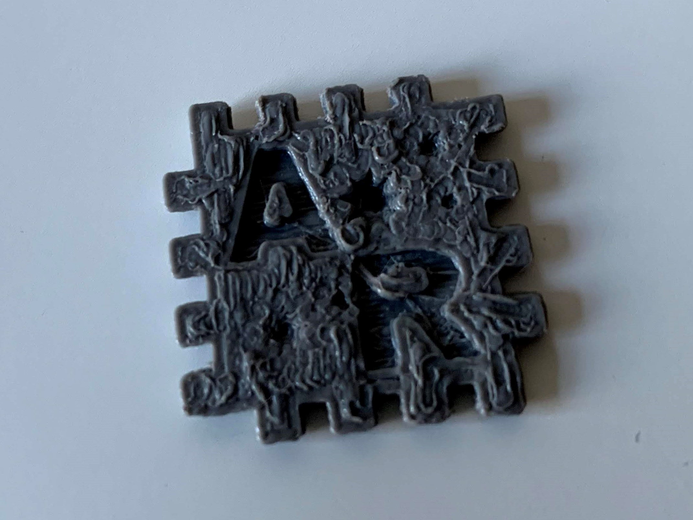
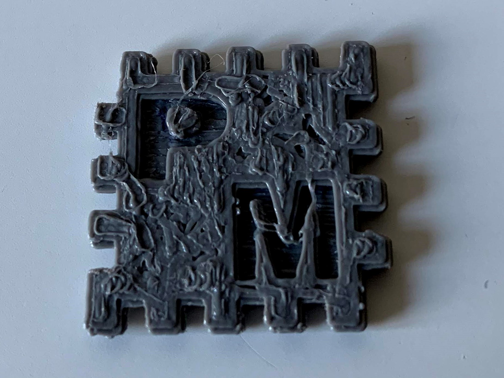
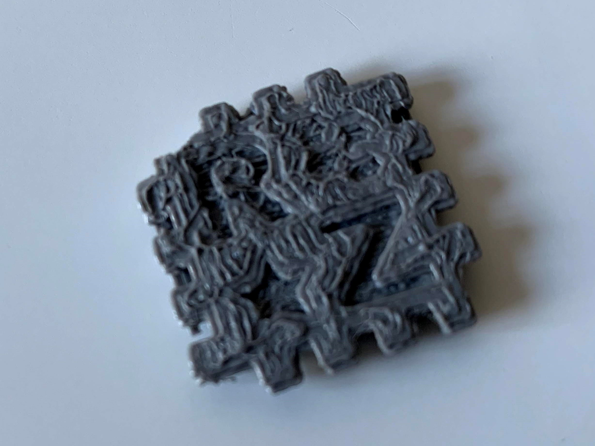
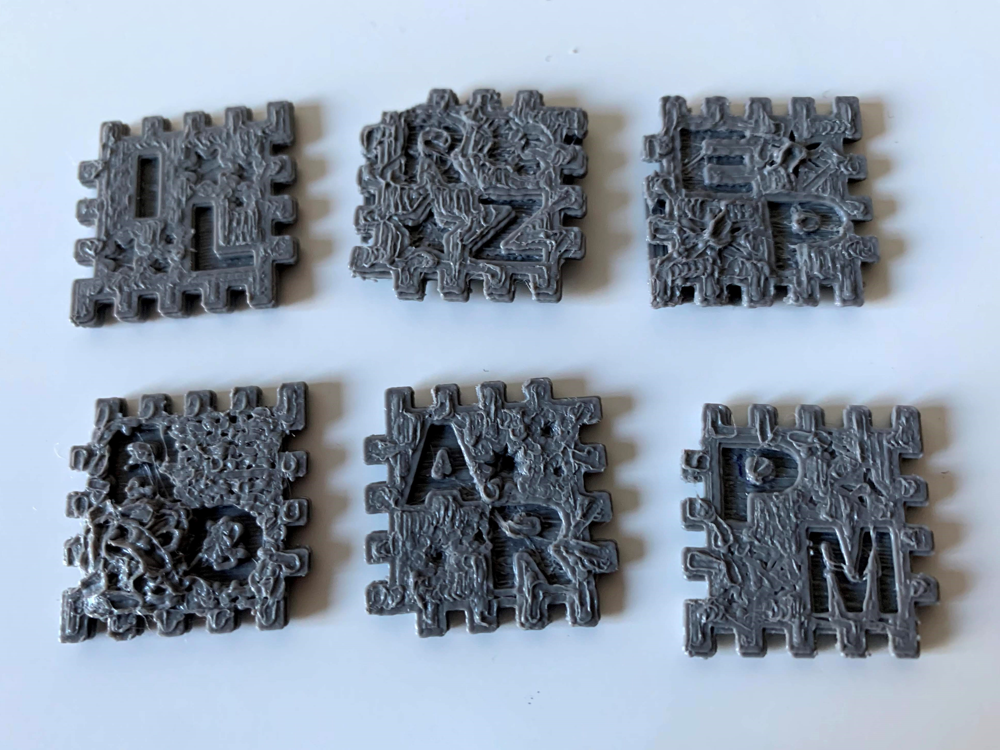

<html>
<head>
<title> Kuba atskaite </title>
<meta charset="UTF-8">
          
		 <body>
		 
<h3> Kuba atskaite - Alise Ruža, 10.e </h3>

		 
<h2> Mūsu kuba veidošanā piedalījos es, Elīna Pūce, Paula Miķelsone, Rūta Zemīte, Roberts Ozoliņš un Ilga Līne 
		 
Pirms karantīnas izveidojām prototipu, kuru paspējām izprintēt, taču to nevarējām salikt kopā. Pirmais mēginājums "izgāzās" . 

		 
 Šeit redzami attēli no pirmā kubiciņa skaldnēm, kuras pat arī ar lielām pūlēm, bija neiespējami salikt.  

		  
		  
		 
 <h1>  Pēc šī neveiksmīgā mēģinājuma, mēs izveidojām otro variantu, kuru grasījāmies izprintēt pirms vēl nenojautām par karanatīnas sākumu, taču nepaspējām 

		 
 <h2> šeit ir links uz otro prototipu - <a href="https://www.youtube.com/watch?v=6Dh-RL__uN4"> This is a nice link </a> 
 
		 